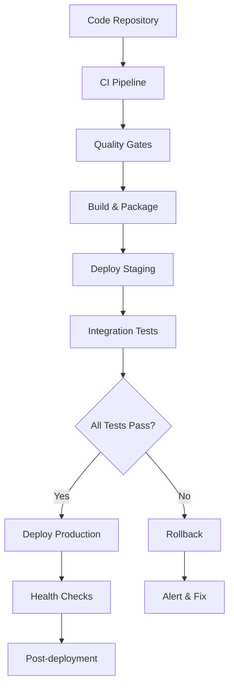

# Phase 4: CI/CD and Automation Implementation Summary

This document summarizes the comprehensive CI/CD and automation implementation for LightRAG, completing Phase 4 of the test and production readiness improvements.

## Implementation Overview

Phase 4 delivers a complete CI/CD pipeline with:
- **Multi-platform CI/CD support** (GitHub Actions & GitLab CI)
- **Comprehensive quality gates** (coverage, linting, security, integration tests)
- **Automated deployment** (Docker and Kubernetes)
- **Build automation** (Makefile, tox, pre-commit hooks)
- **Extensive documentation** and runbooks

## Architecture Summary



## Files Created

### GitHub Actions Workflows (`.github/workflows/`)

#### 1. `ci.yml` - Continuous Integration Pipeline
- **Purpose**: Main CI pipeline for code validation
- **Triggers**: Push to feature branches, PRs, manual dispatch
- **Jobs**: 
  - Code quality checks (Ruff, isort, MyPy, Bandit)
  - Test matrix across Python 3.10-3.12
  - Frontend tests (TypeScript/React)
  - Docker integration tests
  - Coverage analysis with 70% threshold
- **Services**: PostgreSQL, Redis containers for integration testing
- **Artifacts**: Test reports, coverage data, security scan results

#### 2. `cd.yml` - Continuous Deployment Pipeline
- **Purpose**: Automated deployment across environments
- **Triggers**: Main branch (staging), tags (production), manual dispatch
- **Jobs**:
  - Pre-deployment validation
  - Docker image building with multi-arch support
  - Staging deployment (automatic)
  - Production deployment (manual approval)
  - Kubernetes deployment (manual approval)
  - Post-deployment notifications
- **Security**: SBOM generation, image attestation
- **Rollback**: Automatic rollback on failure

#### 3. `security-scan.yml` - Security Vulnerability Scanning
- **Purpose**: Comprehensive security assessment
- **Schedule**: Daily at 2 AM UTC
- **Scan Types**:
  - Dependency vulnerabilities (Safety, pip-audit)
  - Container security (Trivy, Hadolint)
  - Static code analysis (CodeQL, Semgrep)
  - Secrets detection (TruffleHog, GitLeaks)
- **Reporting**: SARIF uploads, automated issue creation
- **Integration**: GitHub Security tab integration

#### 4. `release.yml` - Automated Release Process
- **Purpose**: Complete release automation
- **Triggers**: Version tags (`v*`), manual dispatch
- **Process**:
  - Version validation and CI verification
  - Multi-platform package building
  - Package validation across Python versions
  - GitHub release creation with artifacts
  - PyPI publication (with approval)
  - Documentation updates
- **Artifacts**: Python packages, Docker images, SBOMs

#### 5. `performance-tests.yml` - Performance Monitoring
- **Purpose**: Performance benchmarking and monitoring
- **Schedule**: Weekly on Sundays
- **Test Types**:
  - Baseline performance benchmarks
  - Load testing with Locust
  - Stress testing scenarios
- **Features**: Performance trend analysis, threshold validation
- **Alerting**: Automated issues for performance degradation

### GitLab CI Configuration (`.gitlab-ci.yml`)

#### Pipeline Structure
- **Stages**: validate, build, test, security, deploy, notify
- **Jobs**: 15+ jobs covering all aspects of CI/CD
- **Features**:
  - Parallel test execution
  - Docker-in-Docker support
  - Multi-environment deployment
  - Manual production gates
  - Artifact management

#### Key Features
- **Test Matrix**: Python 3.10-3.12 compatibility
- **Security Integration**: Trivy, dependency scanning
- **Container Registry**: Automatic image pushing
- **Environment Deployment**: Staging and production targets
- **Notification**: Slack integration support

### Quality Gate Scripts (`scripts/ci/`)

#### 1. `check-coverage.sh` - Coverage Enforcement
```bash
./scripts/ci/check-coverage.sh -t 80  # Custom threshold
```
- **Features**:
  - Configurable coverage thresholds
  - Individual file coverage analysis
  - Coverage trend tracking
  - HTML/XML/JSON report generation
  - Coverage badge generation
- **Integration**: CI/CD pipeline integration

#### 2. `lint-and-format.sh` - Code Quality Gate
```bash
./scripts/ci/lint-and-format.sh --fix  # Auto-fix mode
```
- **Tools**: Ruff, isort, MyPy, Bandit
- **Modes**: Check-only (CI) and fix mode (development)
- **Features**:
  - Comprehensive code quality checks
  - Security issue detection
  - Type checking validation
  - Additional quality checks (TODOs, print statements)

#### 3. `security-audit.sh` - Security Vulnerability Assessment
```bash
./scripts/ci/security-audit.sh -t dependencies  # Specific scan type
```
- **Scan Categories**:
  - Dependencies (Safety, pip-audit)
  - Code analysis (Bandit, Semgrep)
  - Secrets detection (pattern-based)
  - Container security (Dockerfile analysis)
- **Reporting**: Comprehensive security reports with recommendations

#### 4. `integration-tests.sh` - End-to-End Testing
```bash
./scripts/ci/integration-tests.sh -e staging -c  # Comprehensive mode
```
- **Test Suites**:
  - API integration testing
  - Database connectivity validation
  - Storage backend compatibility
  - Docker integration verification
- **Features**: Automatic service setup, health monitoring, cleanup

### Deployment Automation (`scripts/deploy/`)

#### 1. `deploy-docker.sh` - Docker Deployment
```bash
./scripts/deploy/deploy-docker.sh -e production -t v1.2.3
```
- **Features**:
  - Environment-specific configuration
  - Image pulling and validation
  - Health check monitoring
  - Automatic rollback on failure
  - Deployment information collection

#### 2. `deploy-k8s.sh` - Kubernetes Deployment
```bash
./scripts/deploy/deploy-k8s.sh -e production -n lightrag-prod
```
- **Methods**: Helm (preferred) and kubectl manifests
- **Features**:
  - Namespace management
  - Resource scaling by environment
  - HPA for production
  - Ingress configuration
  - Health probes and monitoring

#### 3. `rollback.sh` - Automated Rollback
```bash
./scripts/deploy/rollback.sh -e production -t kubernetes -s 2
```
- **Rollback Types**: Docker, Kubernetes, Helm
- **Features**:
  - Automatic deployment type detection
  - Pre-rollback state backup
  - Multi-step rollback support
  - Health check validation
  - Comprehensive reporting

#### 4. `health-check.sh` - Post-Deployment Validation
```bash
./scripts/deploy/health-check.sh -e production --comprehensive
```
- **Check Categories**:
  - Basic and detailed health endpoints
  - API functionality validation
  - Database connectivity verification
  - Resource usage monitoring
  - Performance baseline measurement

### Build Configuration

#### 1. `Makefile` - Unified Build Interface
- **45+ targets** covering all development and deployment tasks
- **Key Features**:
  - Environment-aware configuration
  - Parallel execution support
  - Cross-platform compatibility
  - Comprehensive help system
  - Color-coded output

**Essential Targets**:
```bash
make install-dev     # Development setup
make test           # Run all tests
make quality        # Comprehensive quality checks
make build          # Build packages and containers
make deploy         # Deploy to environment
make health-check   # Validate deployment
```

#### 2. `tox.ini` - Multi-Environment Testing
- **12+ test environments** for different scenarios
- **Features**:
  - Python version matrix testing
  - Specialized test environments
  - CI/CD integration
  - Parallel execution support

**Key Environments**:
- `py{310,311,312}`: Python version compatibility
- `lint`, `security`, `coverage`: Quality gates
- `integration`, `performance`: Specialized testing
- `package`, `docs`: Build validation

#### 3. `.pre-commit-config.yaml` - Git Hooks
- **15+ hooks** for code quality enforcement
- **Categories**:
  - Built-in hooks (whitespace, file size, etc.)
  - Python tools (Ruff, isort, MyPy, Bandit)
  - Security checks (secrets, dependencies)
  - Custom project-specific validations

### Documentation (`docs/ci-cd/`)

#### 1. `CI_CD_GUIDE.md` - Comprehensive CI/CD Guide
- **11 sections** covering all aspects of the pipeline
- **Content**:
  - Pipeline architecture and flow
  - GitHub Actions and GitLab CI details
  - Quality gates and deployment automation
  - Environment management
  - Monitoring and troubleshooting

#### 2. `DEPLOYMENT_RUNBOOK.md` - Operational Procedures
- **Step-by-step procedures** for all deployment scenarios
- **Coverage**:
  - Pre-deployment checklists
  - Environment-specific procedures
  - Rollback and emergency procedures
  - Maintenance windows
  - Post-deployment validation

#### 3. `TROUBLESHOOTING.md` - Issue Resolution Guide
- **Comprehensive troubleshooting** for common issues
- **Categories**:
  - CI pipeline problems
  - Deployment and container issues
  - Database and network problems
  - Performance and security issues
  - Debug tools and automated recovery

## Integration Points

### Test Suite Integration
- **Phases 1-3 test coverage**: Full integration with existing test infrastructure
- **Test markers**: Support for all test categories (unit, integration, security, etc.)
- **Coverage enforcement**: 70% threshold with detailed reporting
- **Performance monitoring**: Benchmark tracking and alerting

### Production Infrastructure
- **Multi-environment support**: Development, staging, production
- **Container orchestration**: Docker Compose and Kubernetes
- **Database backends**: PostgreSQL, Redis with health monitoring
- **Security hardening**: Production-grade security configurations

### Monitoring and Observability
- **Health checks**: Comprehensive endpoint monitoring
- **Performance metrics**: Response time and resource usage tracking
- **Security monitoring**: Vulnerability scanning and alerting
- **Audit logging**: Complete deployment and operation tracking

## Key Features

### Automation Capabilities
- ✅ **Zero-downtime deployments** with health checks
- ✅ **Automatic rollback** on deployment failures
- ✅ **Multi-environment promotion** (dev → staging → production)
- ✅ **Security scanning** with automated issue creation
- ✅ **Performance monitoring** with trend analysis
- ✅ **Release automation** with version management

### Quality Assurance
- ✅ **Code coverage enforcement** (70% threshold)
- ✅ **Multi-tool linting** (Ruff, isort, MyPy, Bandit)
- ✅ **Security vulnerability scanning** (4 different scan types)
- ✅ **Integration testing** across all major components
- ✅ **Performance benchmarking** with baseline tracking

### Developer Experience
- ✅ **Pre-commit hooks** for early issue detection
- ✅ **Unified build interface** via Makefile
- ✅ **Multi-environment testing** with tox
- ✅ **Comprehensive documentation** and runbooks
- ✅ **Debug tools** and automated recovery scripts

### Production Readiness
- ✅ **Multi-platform deployment** (Docker, Kubernetes)
- ✅ **Environment-specific configuration** management
- ✅ **Secrets management** and security hardening
- ✅ **Monitoring and alerting** integration
- ✅ **Backup and disaster recovery** procedures

## Usage Examples

### Development Workflow
```bash
# Set up development environment
make dev-setup

# Run quick checks before commit
make quick

# Run comprehensive quality checks
make quality

# Deploy to staging for testing
make deploy ENVIRONMENT=staging
```

### CI/CD Pipeline
```bash
# Triggered automatically on:
# - Push to feature branches → CI pipeline
# - Merge to main → CI + staging deployment
# - Tag creation → CI + production deployment
# - Schedule → Security scans, performance tests
```

### Production Deployment
```bash
# Tag-based release
git tag -a v1.2.3 -m "Release version 1.2.3"
git push origin v1.2.3

# Manual deployment (emergency)
./scripts/deploy/deploy-docker.sh -e production -t v1.2.3

# Health check validation
./scripts/deploy/health-check.sh -e production --comprehensive
```

### Emergency Procedures
```bash
# Quick rollback
./scripts/deploy/rollback.sh -e production --no-confirm

# Health status check
make status ENVIRONMENT=production

# View logs for debugging
make logs ENVIRONMENT=production
```

## Security Considerations

### Secrets Management
- Environment-specific secret configuration
- GitHub/GitLab secret integration
- Kubernetes secret management
- Credential rotation procedures

### Container Security
- Non-root user execution
- Read-only filesystem mounts
- Resource limits and constraints
- Security scanning integration

### Network Security
- Internal service communication
- SSL/TLS configuration
- Firewall and ingress rules
- Network policy enforcement

## Monitoring and Alerting

### Health Monitoring
- Application health endpoints
- Database connectivity checks
- Service dependency validation
- Performance threshold monitoring

### Security Monitoring
- Vulnerability scan results
- Security incident detection
- Audit log analysis
- Compliance reporting

### Performance Monitoring
- Response time tracking
- Resource utilization monitoring
- Performance trend analysis
- Capacity planning metrics

## Future Enhancements

### Planned Improvements
1. **Advanced monitoring**: Prometheus/Grafana integration
2. **Blue-green deployments**: Zero-downtime deployment strategy
3. **Canary releases**: Gradual rollout capabilities
4. **Multi-region deployment**: Geographic distribution
5. **Advanced security**: Runtime security monitoring

### Integration Opportunities
1. **Service mesh**: Istio/Linkerd integration
2. **GitOps**: ArgoCD/Flux deployment
3. **Observability**: OpenTelemetry integration
4. **Compliance**: Policy-as-code implementation
5. **Testing**: Chaos engineering integration

## Conclusion

Phase 4 successfully implements a comprehensive CI/CD and automation system for LightRAG, providing:

- **Complete pipeline automation** from code commit to production deployment
- **Multi-platform support** for different CI/CD environments
- **Comprehensive quality gates** ensuring code quality and security
- **Production-ready deployment** with monitoring and rollback capabilities
- **Developer-friendly tools** with extensive documentation

The implementation supports the existing test infrastructure from Phases 1-3 while adding robust automation, monitoring, and operational procedures suitable for production environments.

This completes the LightRAG test and production readiness improvements, providing a solid foundation for reliable, secure, and scalable deployments.