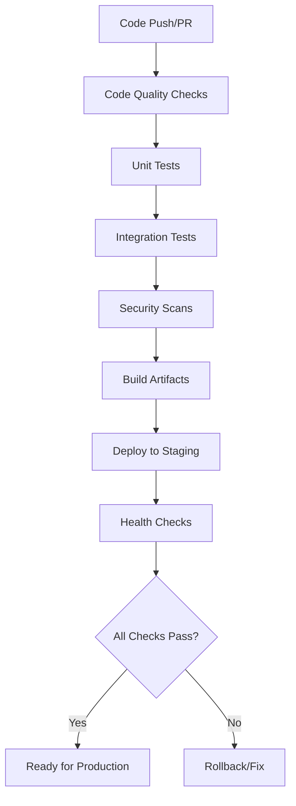
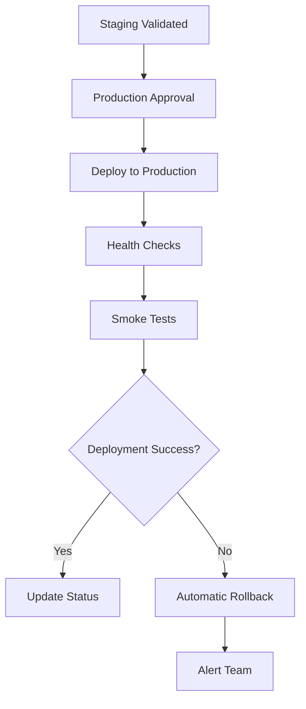

# CI/CD Guide for LightRAG

This document provides comprehensive guidance for the CI/CD pipeline implementation in LightRAG.

## Table of Contents

- [Overview](#overview)
- [Pipeline Architecture](#pipeline-architecture)
- [GitHub Actions](#github-actions)
- [GitLab CI/CD](#gitlab-cicd)
- [Quality Gates](#quality-gates)
- [Deployment Automation](#deployment-automation)
- [Build Configuration](#build-configuration)
- [Environment Management](#environment-management)
- [Monitoring and Observability](#monitoring-and-observability)
- [Troubleshooting](#troubleshooting)

## Overview

LightRAG implements a comprehensive CI/CD pipeline that supports:

- **Multi-platform CI/CD**: GitHub Actions and GitLab CI
- **Comprehensive testing**: Unit, integration, security, and performance tests
- **Quality gates**: Code coverage, linting, security scanning
- **Multi-environment deployment**: Development, staging, production
- **Container orchestration**: Docker and Kubernetes support
- **Automated rollbacks**: Failure recovery mechanisms

### Key Features

- ✅ **Automated testing** across multiple Python versions
- ✅ **Code quality enforcement** with linting and formatting
- ✅ **Security scanning** for vulnerabilities and secrets
- ✅ **Multi-environment deployment** with approval gates
- ✅ **Container-based deployments** with health checks
- ✅ **Rollback capabilities** for failed deployments
- ✅ **Performance monitoring** and benchmarking

## Pipeline Architecture

### CI Pipeline Flow



### CD Pipeline Flow



## GitHub Actions

### Workflow Files

The GitHub Actions implementation consists of 5 main workflows:

#### 1. CI Workflow (`.github/workflows/ci.yml`)

**Purpose**: Continuous Integration pipeline for code validation

**Triggers**:
- Push to main, develop, feature/*, fix/*, hotfix/* branches
- Pull requests to main, develop
- Manual dispatch

**Jobs**:
- **Code Quality**: Linting, formatting, type checking, security scanning
- **Test Matrix**: Unit and integration tests across Python 3.10, 3.11, 3.12
- **Frontend Tests**: TypeScript/React linting and building
- **Docker Tests**: Container integration validation
- **Coverage Analysis**: Test coverage reporting and enforcement

**Key Features**:
- Parallel execution for faster feedback
- Service containers (PostgreSQL, Redis) for integration tests
- Coverage threshold enforcement (70%)
- Artifact collection for reports

#### 2. CD Workflow (`.github/workflows/cd.yml`)

**Purpose**: Continuous Deployment pipeline

**Triggers**:
- Push to main branch (staging deployment)
- Tag creation with `v*` pattern (production deployment)
- Manual dispatch with environment selection

**Jobs**:
- **Pre-deployment Checks**: CI validation and version determination
- **Build and Push Images**: Docker image creation and registry push
- **Deploy Staging**: Automatic staging deployment
- **Deploy Production**: Manual production deployment with approval
- **Deploy Kubernetes**: K8s deployment for production
- **Post-deployment**: Notifications and status updates

**Environment Gates**:
- Staging: Automatic on main branch
- Production: Manual approval required
- Kubernetes: Manual approval required

#### 3. Security Scan Workflow (`.github/workflows/security-scan.yml`)

**Purpose**: Comprehensive security vulnerability scanning

**Triggers**:
- Daily schedule (2 AM UTC)
- Push to main branch
- Pull requests to main
- Manual dispatch with scan type selection

**Scan Types**:
- **Dependency Scan**: Safety, pip-audit, Bandit
- **Container Scan**: Trivy, Hadolint
- **Code Scan**: CodeQL, Semgrep
- **Secrets Scan**: TruffleHog, GitLeaks

**Reporting**:
- SARIF uploads to GitHub Security tab
- Summary reports and badges
- Automated issue creation for critical findings

#### 4. Release Workflow (`.github/workflows/release.yml`)

**Purpose**: Automated release process

**Triggers**:
- Tag creation with `v*` pattern
- Manual dispatch with version specification

**Process**:
1. **Validation**: Version format, CI status, release readiness
2. **Build**: Python packages, Docker images with attestation
3. **Testing**: Multi-version package validation
4. **Release Creation**: GitHub release with artifacts
5. **Publication**: PyPI publication (if authorized)
6. **Documentation**: Version reference updates

#### 5. Performance Tests Workflow (`.github/workflows/performance-tests.yml`)

**Purpose**: Performance monitoring and benchmarking

**Triggers**:
- Weekly schedule (Sundays 3 AM UTC)
- Changes to performance-critical code
- Manual dispatch with test type selection

**Test Types**:
- **Baseline Performance**: Core functionality benchmarks
- **Load Testing**: Multi-user concurrent access
- **Stress Testing**: Resource exhaustion scenarios

### Environment Variables

```yaml
# Required for all workflows
PYTHON_VERSION: '3.10'
NODE_VERSION: '18'
COVERAGE_THRESHOLD: 70

# Database configuration
POSTGRES_USER: lightrag
POSTGRES_PASSWORD: lightrag
POSTGRES_DB: lightrag_test
REDIS_URL: redis://localhost:6379

# Container registry
REGISTRY: ghcr.io
IMAGE_NAME: ${{ github.repository }}
```

### Secrets Required

- `GITHUB_TOKEN`: Automatic (no setup required)
- `PYPI_API_TOKEN`: For PyPI publication
- `STAGING_API_URL`: Staging environment URL
- `STAGING_API_KEY`: Staging API key
- `PRODUCTION_API_URL`: Production environment URL
- `PRODUCTION_API_KEY`: Production API key
- `KUBECONFIG`: Kubernetes configuration (base64 encoded)
- `SLACK_WEBHOOK_URL`: Optional notification webhook

## GitLab CI/CD

### Pipeline Configuration (`.gitlab-ci.yml`)

The GitLab CI implementation provides equivalent functionality to GitHub Actions:

#### Stages

1. **Validate**: Code quality and configuration validation
2. **Build**: Package and container building
3. **Test**: Comprehensive test execution
4. **Security**: Vulnerability and security scanning
5. **Deploy**: Multi-environment deployment
6. **Notify**: Status notifications

#### Key Features

- **Docker-in-Docker**: Container building and testing
- **Parallel Testing**: Matrix builds across Python versions
- **Artifact Management**: Test reports and coverage data
- **Environment Deployment**: Staging and production targets
- **Manual Gates**: Production deployment approval

#### Variables Required

```yaml
# CI/CD Variables (configure in GitLab project settings)
ENVIRONMENT: staging
REGISTRY: $CI_REGISTRY
IMAGE_NAME: $CI_PROJECT_PATH
KUBECONFIG_CONTENT: # Base64 encoded kubeconfig
SLACK_WEBHOOK_URL: # Optional notifications
```

### GitLab Environments

- **Staging**: Automatic deployment from main branch
- **Production**: Manual deployment with approval
- **Kubernetes**: Manual deployment for K8s environments

## Quality Gates

### Coverage Gate (`scripts/ci/check-coverage.sh`)

**Purpose**: Enforce code coverage thresholds

**Features**:
- Configurable coverage threshold (default: 70%)
- Individual file coverage analysis
- Coverage trend tracking
- HTML and XML report generation
- Coverage badge generation

**Usage**:
```bash
# Run with default threshold (70%)
./scripts/ci/check-coverage.sh

# Custom threshold
./scripts/ci/check-coverage.sh -t 80

# Environment variable
COVERAGE_THRESHOLD=85 ./scripts/ci/check-coverage.sh
```

### Linting Gate (`scripts/ci/lint-and-format.sh`)

**Purpose**: Code quality and style enforcement

**Tools**:
- **Ruff**: Fast Python linter and formatter
- **isort**: Import statement organization
- **MyPy**: Static type checking (non-blocking)
- **Bandit**: Security issue detection (non-blocking)

**Modes**:
- **Check-only** (default): Validate without changes
- **Fix mode**: Automatically fix issues

**Usage**:
```bash
# Check only (default)
./scripts/ci/lint-and-format.sh

# Fix mode
./scripts/ci/lint-and-format.sh --fix

# Environment variable
FIX_MODE=true ./scripts/ci/lint-and-format.sh
```

### Security Gate (`scripts/ci/security-audit.sh`)

**Purpose**: Comprehensive security vulnerability assessment

**Scan Categories**:
- **Dependencies**: Safety, pip-audit vulnerability scanning
- **Code**: Bandit, Semgrep static analysis
- **Secrets**: Pattern-based hardcoded secret detection
- **Containers**: Dockerfile security analysis

**Configuration**:
```bash
# Full security audit
./scripts/ci/security-audit.sh

# Specific scan type
./scripts/ci/security-audit.sh -t dependencies

# Custom output directory
./scripts/ci/security-audit.sh -o /tmp/security-reports

# Don't fail on high severity (for CI flexibility)
FAIL_ON_HIGH=false ./scripts/ci/security-audit.sh
```

### Integration Gate (`scripts/ci/integration-tests.sh`)

**Purpose**: End-to-end system validation

**Test Suites**:
- **API Integration**: Health checks and endpoint validation
- **Database Integration**: PostgreSQL and Redis connectivity
- **Storage Backend**: Multi-backend compatibility testing
- **Docker Integration**: Container orchestration validation

**Environment Setup**:
- Automatic service waiting and initialization
- Database schema creation and cleanup
- Container health monitoring
- Port conflict resolution

## Deployment Automation

### Docker Deployment (`scripts/deploy/deploy-docker.sh`)

**Purpose**: Automated Docker-based deployment

**Features**:
- Environment-specific configuration management
- Image pulling and validation
- Health check monitoring
- Rollback on failure
- Deployment information collection

**Environments**:
- **Development**: docker-compose.yml
- **Staging**: docker-compose.yml with staging config
- **Production**: docker-compose.production.yml

**Usage**:
```bash
# Deploy to staging
./scripts/deploy/deploy-docker.sh -e staging -t v1.2.3

# Deploy to production
./scripts/deploy/deploy-docker.sh -e production -t latest

# Custom registry and image
./scripts/deploy/deploy-docker.sh -e staging \
  -r ghcr.io -i myorg/lightrag -t dev
```

### Kubernetes Deployment (`scripts/deploy/deploy-k8s.sh`)

**Purpose**: Kubernetes cluster deployment automation

**Deployment Methods**:
- **Helm**: Chart-based deployment (preferred)
- **kubectl**: Manifest-based deployment (fallback)

**Features**:
- Namespace management and isolation
- Resource scaling based on environment
- Health check and readiness probes
- Ingress configuration for production
- Horizontal Pod Autoscaling (HPA)

**Usage**:
```bash
# Deploy to staging namespace
./scripts/deploy/deploy-k8s.sh -e staging -t v1.2.3

# Deploy to production with custom namespace
./scripts/deploy/deploy-k8s.sh -e production -t latest \
  -n lightrag-prod

# Disable automatic rollback
./scripts/deploy/deploy-k8s.sh -e staging --no-rollback
```

### Rollback Automation (`scripts/deploy/rollback.sh`)

**Purpose**: Automated deployment rollback capabilities

**Rollback Methods**:
- **Docker**: Container replacement with previous images
- **Kubernetes**: Deployment revision rollback
- **Helm**: Release history rollback

**Features**:
- Automatic deployment type detection
- Pre-rollback state backup
- Health check validation
- Data backup restoration (optional)
- Rollback verification and reporting

**Usage**:
```bash
# Auto-detect and rollback
./scripts/deploy/rollback.sh -e staging

# Specific deployment type
./scripts/deploy/rollback.sh -e production -t kubernetes

# Multiple step rollback
./scripts/deploy/rollback.sh -e staging -s 2

# Skip confirmation
./scripts/deploy/rollback.sh -e staging --no-confirm
```

### Health Check Automation (`scripts/deploy/health-check.sh`)

**Purpose**: Post-deployment validation and monitoring

**Check Categories**:
- **Basic Health**: Application startup and responsiveness
- **Detailed Health**: Component status and dependencies
- **API Functionality**: Endpoint testing and validation
- **Database Connectivity**: Storage backend verification
- **Resource Usage**: Performance and utilization monitoring

**Features**:
- Deployment type auto-detection
- Kubernetes port-forwarding for testing
- Comprehensive vs. basic check modes
- Performance baseline measurement
- Health report generation

## Build Configuration

### Makefile

**Purpose**: Unified build automation interface

**Key Targets**:
- `make install-dev`: Development environment setup
- `make test`: Run all tests
- `make quality`: Comprehensive quality checks
- `make build`: Build packages and containers
- `make deploy`: Deploy to current environment
- `make health-check`: Validate deployment health

**Environment Variables**:
- `ENVIRONMENT`: Deployment target (staging/production)
- `DOCKER_TAG`: Container image tag
- `PYTHON`: Python executable path

### Tox Configuration (`tox.ini`)

**Purpose**: Multi-environment testing automation

**Test Environments**:
- `py{310,311,312}`: Python version matrix testing
- `lint`: Code quality validation
- `security`: Security vulnerability scanning
- `coverage`: Test coverage analysis
- `docs`: Documentation building
- `package`: Package building and validation

**Specialized Environments**:
- `integration`: Integration test execution
- `performance`: Performance benchmarking
- `api`: API-specific testing
- `storage`: Storage backend testing
- `prod`: Production-like testing

### Pre-commit Hooks (`.pre-commit-config.yaml`)

**Purpose**: Git commit quality enforcement

**Hook Categories**:
- **Built-in**: Trailing whitespace, file size, merge conflicts
- **Python**: Ruff formatting, isort, mypy, bandit
- **Containers**: Hadolint Dockerfile linting
- **Shell**: Shellcheck script validation
- **Security**: Secrets detection, dependency scanning
- **Custom**: Project-specific validations

**Installation**:
```bash
# Install pre-commit
pip install pre-commit

# Install hooks
pre-commit install

# Run on all files
pre-commit run --all-files
```

## Environment Management

### Environment Files

- **env.example**: Template with all variables
- **production.env**: Production configuration template
- **staging.env**: Staging-specific settings (optional)

### Variable Categories

#### Core Application
```bash
NODE_ENV=production
DEBUG=false
LOG_LEVEL=INFO
PORT=9621
HOST=0.0.0.0
```

#### Database Configuration
```bash
POSTGRES_HOST=postgres
POSTGRES_PORT=5432
POSTGRES_USER=lightrag
POSTGRES_PASSWORD=${POSTGRES_PASSWORD}
POSTGRES_DB=lightrag
REDIS_URL=redis://redis:6379
```

#### Security Settings
```bash
JWT_SECRET_KEY=${JWT_SECRET_KEY}
JWT_EXPIRE_HOURS=24
AUTH_ENABLED=true
RATE_LIMIT_ENABLED=true
```

#### LLM Configuration
```bash
LLM_BINDING=openai
LLM_MODEL=gpt-3.5-turbo
EMBEDDING_BINDING=openai
EMBEDDING_MODEL=text-embedding-ada-002
```

### Secrets Management

#### GitHub Actions
- Use GitHub Secrets for sensitive data
- Environment-specific secret scoping
- Secret rotation procedures

#### GitLab CI/CD
- Use GitLab CI/CD Variables
- Masked and protected variable configuration
- Environment-specific variable scoping

#### Kubernetes
- Use Kubernetes Secrets
- Secret encryption at rest
- Service account token rotation

## Monitoring and Observability

### Metrics Collection

- **Application Metrics**: Response times, error rates, throughput
- **Infrastructure Metrics**: CPU, memory, disk usage
- **Business Metrics**: Query success rates, document processing

### Logging

- **Structured Logging**: JSON format for machine processing
- **Log Levels**: DEBUG, INFO, WARNING, ERROR
- **Centralized Collection**: ELK stack or cloud logging

### Alerting

- **Health Check Failures**: Immediate notification
- **Performance Degradation**: Threshold-based alerts
- **Security Issues**: Critical vulnerability detection
- **Deployment Status**: Success/failure notifications

### Dashboards

- **Application Dashboard**: Key performance indicators
- **Infrastructure Dashboard**: Resource utilization
- **CI/CD Dashboard**: Pipeline success rates and duration

## Troubleshooting

### Common Issues

#### CI Pipeline Failures

1. **Test Failures**
   - Check test logs for specific errors
   - Verify service dependencies are healthy
   - Ensure environment variables are set correctly

2. **Build Failures**
   - Validate Dockerfile syntax
   - Check dependency installation
   - Verify base image availability

3. **Security Scan Failures**
   - Review vulnerability reports
   - Update dependencies if needed
   - Whitelist false positives if necessary

#### Deployment Failures

1. **Health Check Failures**
   - Verify application startup logs
   - Check database connectivity
   - Validate configuration settings

2. **Container Issues**
   - Check image availability
   - Verify resource limits
   - Review container logs

3. **Network Issues**
   - Validate port configurations
   - Check service discovery
   - Verify ingress/load balancer settings

### Debug Commands

#### Local Development
```bash
# Run specific test categories
make test-unit
make test-integration

# Check code quality
make lint
make security

# Local deployment
make deploy ENVIRONMENT=development
```

#### CI/CD Debugging
```bash
# Reproduce CI environment locally
docker run -it --rm -v $(pwd):/workspace python:3.10-slim bash
cd /workspace
pip install -e ".[test,api]"
pytest tests/ -v

# Test deployment scripts
ENVIRONMENT=staging ./scripts/deploy/deploy-docker.sh
```

#### Production Debugging
```bash
# Check deployment status
make status ENVIRONMENT=production

# View logs
make logs ENVIRONMENT=production

# Run health checks
make health-check ENVIRONMENT=production
```

### Log Analysis

#### Application Logs
```bash
# Docker logs
docker logs lightrag_app_1 --tail=100 -f

# Kubernetes logs
kubectl logs -l app=lightrag -n lightrag-production --tail=100 -f
```

#### CI/CD Logs
- GitHub Actions: Check workflow run details
- GitLab CI: Review job logs in pipeline view
- Local: Use `make logs` with appropriate environment

### Performance Analysis

#### Benchmarking
```bash
# Run performance tests
make test-performance

# Analyze benchmark results
python -c "
import json
with open('benchmark-results.json') as f:
    data = json.load(f)
for test in data['benchmarks']:
    print(f\"{test['name']}: {test['stats']['mean']:.3f}s\")
"
```

#### Resource Monitoring
```bash
# Container resource usage
docker stats lightrag_app_1

# Kubernetes resource usage
kubectl top pods -n lightrag-production
kubectl describe pod -l app=lightrag -n lightrag-production
```

---

This CI/CD guide provides comprehensive coverage of the LightRAG pipeline implementation. For specific operational procedures, refer to the [Deployment Runbook](DEPLOYMENT_RUNBOOK.md) and [Troubleshooting Guide](TROUBLESHOOTING.md).